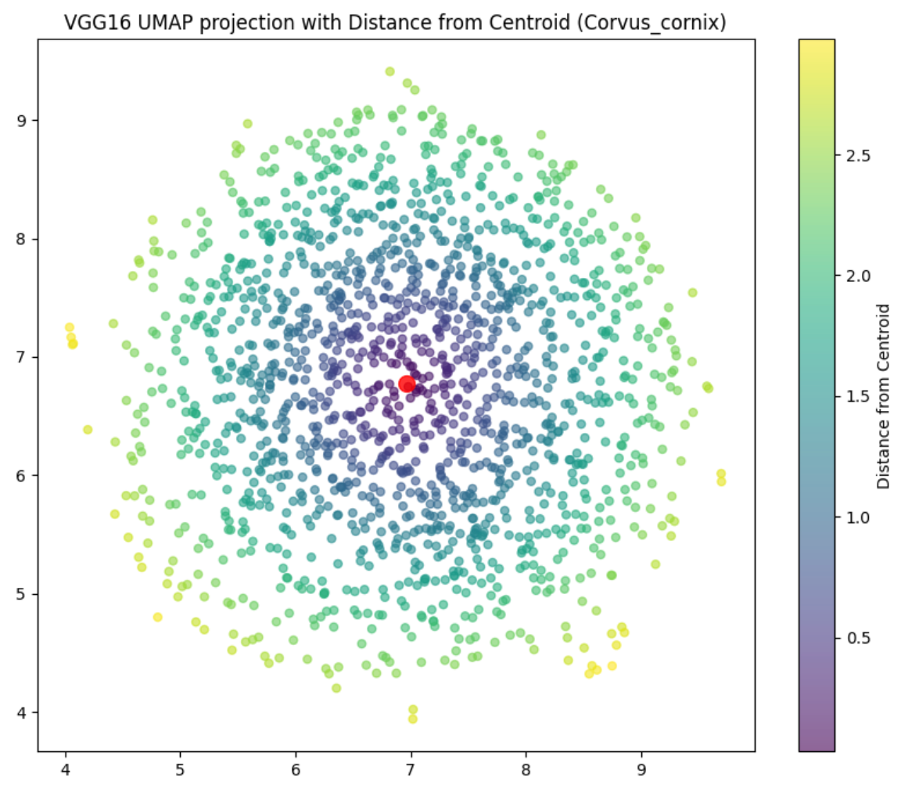
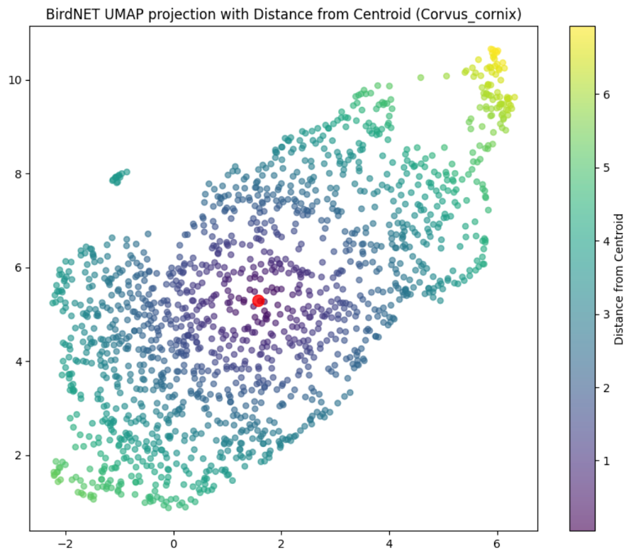
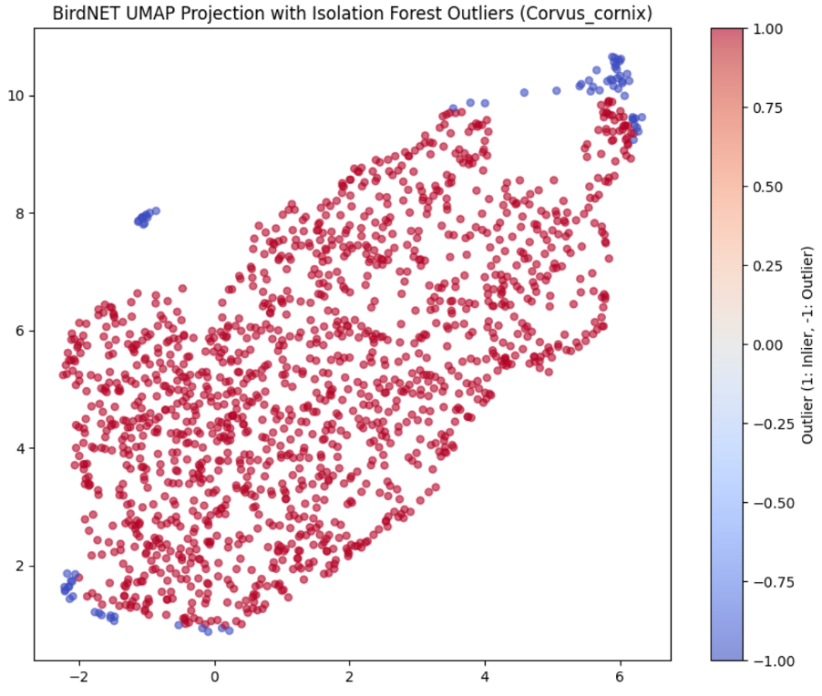

# Spectrogram Embedding & Clustering
Sorting through spectrogram training data for bioacoustics models is a long and tedious task. However, having clean training data is critical for achieving good model performance.

### This repository contains two Jupyter notebooks for spectrogram feature extraction and clustering:
- VGG16-based Feature Extraction – Uses VGG16 with the final layer removed to extract spectrogram embeddings.

- birdnet_features – Prepocesses PNG images to format BirdNET accepts (instead of raw audio), extracts feature embeddings.

### To visualise and identify outliers in the extracted embeddings, UMAP dimensionality and clustering is applied. Two techniques are then applied to distinguish outliers from the core group:
- Euclidean Distance from the Centroid – Measures how far each point deviates from the cluster center.
- Isolation Forest – A machine learning approach that detects anomalies based on an adjustable contamination parameter.

These methods help filter out noisy or misclassified spectrogram embeddings, improving dataset quality for model training.